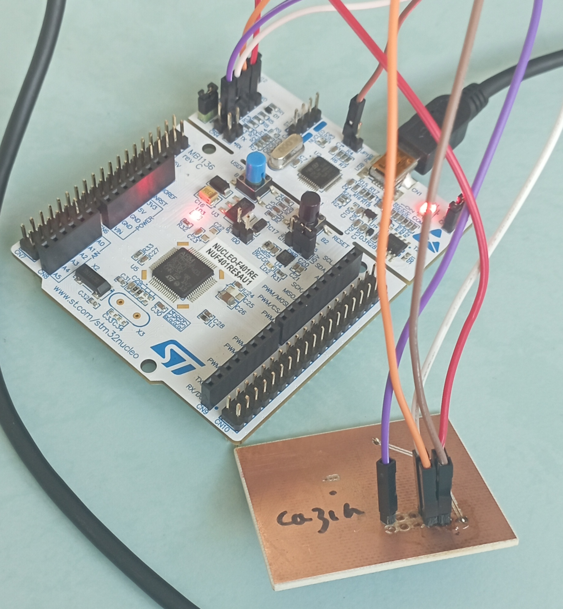

# STM32F030F4 Bare metal programming
# __Embedded Programming Part__

## Table of content

 * [General project information](#general-project-information)
 * [Makefile](#makefile)
 * [tests directory](#tests-directory)
 * [src directory](#src-directory)
 * [lib directory](#lib-directory)
 * [build directory](#build-directory)
 * [Picture](#picture)
 * [Documentation used](#documentation-used)
 * [Contact](#contact)

## General design information

For the embedded programming part of this project, we had to code the ARM Cortex microcontroller using bare metal programming. This program is therefore in the form of an .elf file to be injected into the microcontroller via the ARM JTAG connector. In addition, we had to run unit tests all around the code to check that it worked properly.

## Makefile

The makefile is made up of several targets, each of which performs a specific task.
 - The __main target__ compiles files in the _"src"_ directory using the _"arm-none-eabi-gcc"_ compiler. This needs its linker, which can be found in the _"lib"_ directory. This compiler generates an .elf file which can be injected into the microcontroller via the ARM JTAG connector. As we're creating embedded code, we optimize the size of the .elf file with the __"-O1"__ option. This option is only set to 1, because from 2 onwards, the compiler transforms optimizations made in the microcontroller startup file into functions not present in the libraries on the school's computers, as these libraries are not downloadable at school. These functions are, for example, memcpy and memset, which replace the optimization already carried out for copying SRAM into flash. Additionally, while testing the sensor voltage to temperature conversion function, we noticed that the "arm-none-eabi-gcc" compiler is not capable of using the "float" data type. ". However in our case, it is necessary to use it for the conversion. We then did research to activate floating points but we had to modify the compiler linker and the "mfloat-abi" option did not work even with the hard value.
- the __test target__ is used to create a test executable. These tests are only performed on the _"functions"_ file, as it is the only file with testable functions. We also use the gcc compiler instead of arm-none-eabi-gcc to create the executable file without errors.
- the __load target__ connects to the Nucleo board, enabling the embedded program to be transferred to the microcontroller.
- the __clean target__ deletes temporary files from the _"build"_ directory.
- the __coverage target__ is used to create files displaying the program's coverage. 

## tests directory

This directory __contains the C file for all tests performed__. It performs unit tests on the functions in the _"functions.c"_ file. Tests are mainly performed on register values.

## src directory

This directory contains all the files needed to create the .elf file that can be injected into the microcontroller via the ARM JTAG connector. It is made up of several files: 
 - The __"functions.h"__ file defines all register addresses and function prototypes in its .c file. Register addresses can be found in the datasheet starting on page 38 (Reference manual --> Documentation / Reference Manuals on the 2nd link).
 - the __"functions.c"__ file is used to define all functions and modify all registers to use the components. In general, registers are defined on 16 bits corresponding to 16 pins, and a bit 1 must be set at the corresponding register location. However, the _GPIOA_MODER register_ is defined on 32 bits, so you need to work on 2 bits for each pin. 
 - the __"stm32_startup"__ file is used to configure the microcontroller, since we're programming in bare metal. We then need to define each handler and each corresponding section for it to work. We must also add that the SRAM is 4kb and the Flash is 16kb. This file has been adapted from the tutorial available in the documentation (1st link).
 - the __"main"__ file is the file that calls the functions. The _RCC_AHBENR register_ is configured for clock A, which enables PAx pins to be used.
In the __"functions.h"__ and __"functions.h"__ files, defines vary depending on whether the file is used on an X86 machine or not. This is to enable testing of register values and avoid volatile conflicts. 

## lib directory

This directory contains libraries used when compiling and transferring the .elf file :
 - the __"stm32f030f4.ld"__ file corresponds to the linker used by the compiler thanks to the -T option and it explains how the different sections of the startup file must be brought together to create the .elf file. It also contains zone definitions, addresses and memory sizes.
 - the __"stm32nucleo.cfg"__ file is the file allowing the connection with the Nucleo debug board.

## build directory

This directory corresponds to the directory where the compiled files are stored. These files are erased during the "make clean" command.

## Picture

## Documentation used

* _[Bare Metal - From zero to blink](https://linuxembedded.fr/2021/02/bare-metal-from-zero-to-blink)_
* _[Arm Cortex-M0 Datasheet](https://www.st.com/en/microcontrollers-microprocessors/stm32f030f4.html#documentation)_
* _[Bare metal STM32 Examples](https://github.com/joved-git/Bare_Metal_STM32/blob/master/stm32f103x/stm32_startup_f103x.c)_
* _[Functions of the lib "check.h"](https://libcheck.github.io/check/doc/check_html/check_4.html)_
* _[Options of the arm-none-eabi-gcc compiler](https://gcc.gnu.org/onlinedocs/gcc/ARM-Options.html)_
* _[Forum on floating points for arm-none-eabi-gcc compiler](https://stackoverflow.com/questions/54534700/enabling-floating-point-emulation-in-gcc-arm-none-eabi)_

## Contact

Created by [@nemo.cazin.etu] & Antoine Cegarra