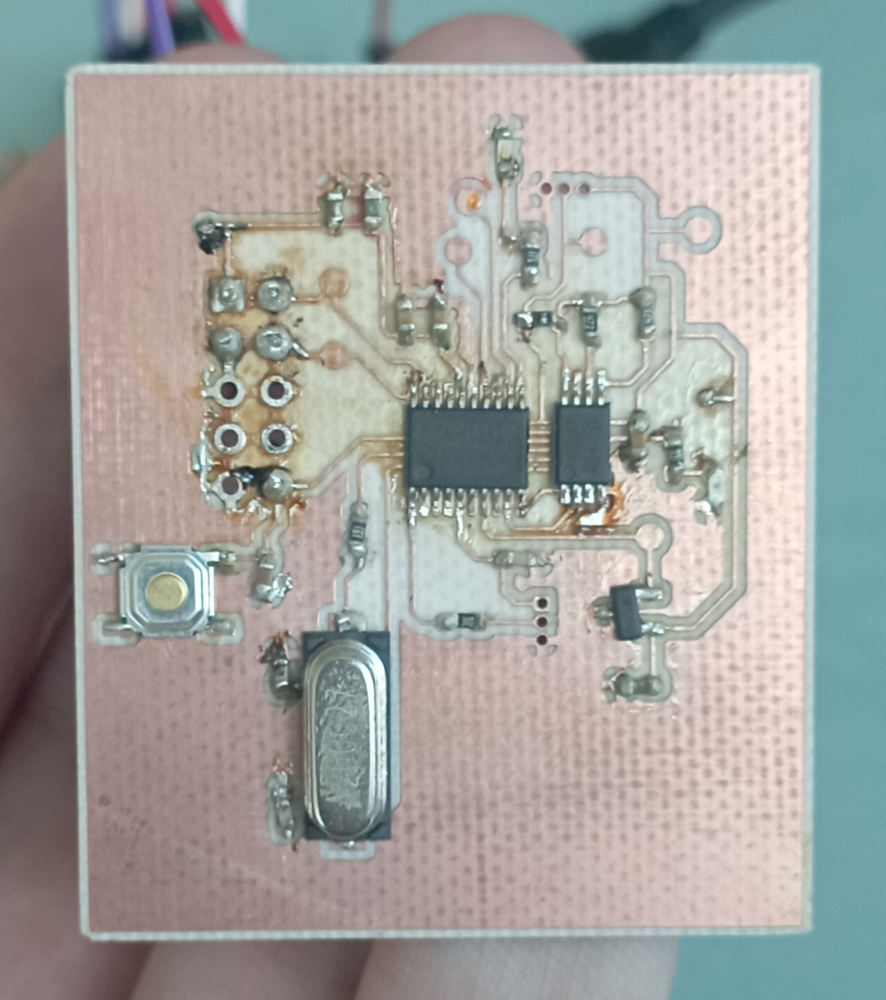

# STM32F030F4 Bare metal programming
# __PCB Conception Part__

## Table of content

 * [General project information](#general-project-information)
 * [Schematic design](#cchematic-design)
    * [STM32F030F4 ARM Cortex microcontroller configuration](#stm32f030f4-arm-cortex-microprocessor-configuration)
    * [M24C01 EPROM memory configuration](#m24c01-eprom-memory-configuration)
    * [MCP9700 temperature sensor configuration](#mcp9700-temperature-sensor-configuration)
    * [ARM JTAG connector configuration](#arm-jtag-connector-configuration)
    * [Other components](#other-components)
    * [Decoupling capacitors](#decoupling-capacitors)
    * [TestPoints documentation](#testpoints-documentation)
 * [PCB design](#pcb-design)
 * [Gerber files](#gerber-files)
 * [Soldering](#soldering)
 * [Documentation used](#documentation-used)
 * [Contact](#contact)

## General design information

This project enabled us to design an electronic board for mass production. This put us in a real design situation, so we had to be rigorous in our work and explanations.
For the design of this electronic board, several components were imposed on us. Firstly, the microcontroller is an __STM32F030F4 Arm Cortex__ with a 32-bit RISC-V core. Next, we had to use a __1kbit M24C01 EPROM memory__ on the I2C serial bus. Last but not least, a __Low-Power Linear Active MCP9700 temperature sensor__ was required.
With this information on the components we needed, we began the schematic of our board.

## Schematic design

### STM32F030F4 ARM Cortex microcontroller configuration

As we're using an ARM Cortex microcontroller, we had to do a lot of research to create the schematic around this component. First of all, the __NRST pin__ corresponds to the reset and a 0.1uF capacitor is connected. This information comes from the microcontroller documentation, so we did the same. 
The __BOOTO pin__ is used to control the microcontroller's start-up mode. _When the pin is in the low state (0)_, the microcontroller starts normally from its internal flash memory, where the user program is stored. On the contrary, _when the pin is high (1)_, the microcontroller starts up in special boot mode. This means it will attempt to boot from a different boot source, such as a connected programming device (like an ST-Link or bootloader), or from external memory (like separate flash memory). We've therefore chosen to connect this pin to a 3-pin connector linked to VCC or GND, so as to manually select the microcontroller's start-up mode. This can be seen as manual debugging.
__Pins PF0 and PF1__ correspond to clock management, for which we also used the microcontroller documentation which gave us the schematic. We also used an 8MHz quartz clock, which is the microcontroller frequency.

### M24C01 EPROM memory configuration

To manage the M24C01 EPROM memory component, several pins are connected directly to the microcontroller input/output pins: 
 - __The SDA pin__ is used to transmit data between the EEPROM and the master device. Data to be written to or read from the EEPROM are transmitted via this line. It is linked to pin PA10 of the microcontroller, corresponding to I2C management from master to slave.
 - __The SCL pin__ provides a synchronization clock for serial communication between the EEPROM and the master device. This clock ensures that data is transmitted and received synchronously between the peripherals. It is connected to pin PA9 of the microcontroller.
 - __Pins E0, E1 and E2__ on an EPROM are used to configure the device address. These pins define the EPROM address on the I2C bus. When one of the pins is connected to ground (GND), it sets the least significant bit of the EPROM address to 0. If it is left floating or connected to a high voltage (VCC), it will set this bit to 1. These pins are then connected to pins PA4, PA3, PA2 of the microcontroller.
 - __Pin WC__ controls memory write protection. _When pin WC is held low (0)_ or connected to ground (GND), this indicates that memory write protection is enabled. This means that EEPROM write operations are disabled or protected from modification. On the other hand, _when pin WC is held high (1)_ or connected to a supply voltage (VCC), this indicates that write protection is disabled, allowing normal write operations on the EEPROM memory. This pin is also connected to pin PA7 of the microcontroller. We've also added a 3-pin connector for manual debugging.
This component also operates at 5V, so it is connected directly to VCC for power supply.
Pull-up resistors have been added to initialize the SDA, SCL and EPROM pins to the high state when the electronic board is powered up. This prevents random data from being written to memory. 

### MCP9700 temperature sensor configuration

The MCP9700 temperature sensor is easy to use. __A single output pin named TEMP__ gives the temperature value at several voltage levels. We connected it to the PA1 input/output pin of the microcontroller. This component also operates at 5V, so it's connected directly to VCC for power supply.

### ARM JTAG connector configuration

This connector allows you to control the power supply to the electronic board, as well as program the microntrolleur and perform simple debugging. This component operates at 5V, so it's connected directly to VCC for power supply.
We use two pins for this component: 
 - __The SWDIO pin__ is used to transmit data between the debugger and the microcontroller. This is a bidirectional data line where debug instructions, programming data and read data can be transmitted in both directions. We then connected it to the PA13 input/output pin of the microcontroller.
 - __The SWDCLK pin__ is used to synchronize communication between the debugger and the microcontroller. This clock ensures that data is transmitted synchronously and consistently between the two devices. We then connected it to the PA14 input/output pin on the microcontroller.

### Other components

We've added __two debugging LEDs__ on pins PA0 and PA5 of the microcontroller.

### Decoupling capacitors

The imposed components need decoupling capacities in order to function correctly: 
 - the STM32F030F4 microcontroler needs __5 decoupling capacitors__: C4 at 1uF, C5 at 10nF, C6 at 100nF, C8 at 4.7uF and C10 at 100nF.
 - the M24C01 serial EEPROM memory requires __one decoupling capacitor__ C9 at 100nF.
 - the MCP9700 temperature sensor requires __one decoupling capacitor__ of C7 at 1uF.

### TestPoints documentation

We've added testpoints to check the voltages of certain critical tracks, and also to potentially add additional components. These testpoints also serve as a means of debugging: 
 - __TP1__ is connected to the PB1 input/output pin to potentially add a component
 - __TP2__ is connected to the microcontroller's VCC pin to monitor the voltage value and modify it if necessary
 - __TP3__ is connected to input/output pin PA6 to potentially add a component
 - __TP4__ is connected to the temperature sensor's temperature output pin to monitor output voltage values
 - __TP5__ is connected to the EPROM pin of the EPROM to check voltage and also control EPROM protection manually
 - __TP6__ is connected to the SWCLK pin of the JTAG connector to check synchronization clock voltages 
 - __TP7__ is connected to the SWCLK pin of the JTAG connector if data is being transmitted

## PCB design

For the creation of the PCB, we wanted to do mostly single-sided to facilitate production. In the end, we had to make a track on the underside.
For component footprints other than those specified, we used those from the SparkFun library. 
To place the components, we assembled them together as shown in the schematic. We also grouped the testpoints together to facilitate debugging. Component decoupling capabilities have also been glued to the respective components.
Long tracks for VCC and GND run around the board, which is not optimized but will work in our application.
The result is a 47x40 mm board, with a ground plane on each side.

## Gerber files

We left the Gerber files in the directory in a ZIP file. These are used to create the stencils for the electronic board. These files can be used on a Gerber Viewer like site : [Gerber Viewer](https://www.pcbway.com/project/OnlineGerberViewer.html); 

## Soldering

We soldered the components to the board using tin. As the components are very small, soldering them was a bit tricky.
Here's the soldered board :

## Documentation used

* _[STM32F030F4 microcontroler](https://www.st.com/en/microcontrollers-microprocessors/stm32f030f4.html)_
* _[STM32F030F4 microcontroller hardware consideration](https://www.google.com/url?sa=t&rct=j&q=&esrc=s&source=web&cd=&ved=2ahUKEwjCvNPB3rKEAxWJRqQEHd2wAtIQFnoECA4QAQ&url=https%3A%2F%2Fwww.st.com%2Fresource%2Fen%2Fapplication_note%2Fan4325-getting-started-with-stm32f030xx-and-stm32f070xx-series-hardware-development-stmicroelectronics.pdf&usg=AOvVaw3LE5Z_h3sACrHhfwqq26Si&opi=89978449)_
* _[M24C01 serial EEPROM memory](https://www.st.com/en/memories/m24c01-r.html)_
* _[MCP9700 temperature sensor](https://www.microchip.com/en-us/product/mcp9700)_
* _[MCP9700 temperature sensor hardware consideration](http://ww1.microchip.com/downloads/en/devicedoc/20001942g.pdf)_

## Contact

Created by [@nemocazin] & Antoine Cegarra
